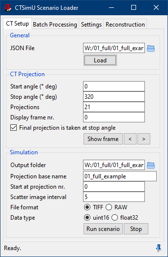
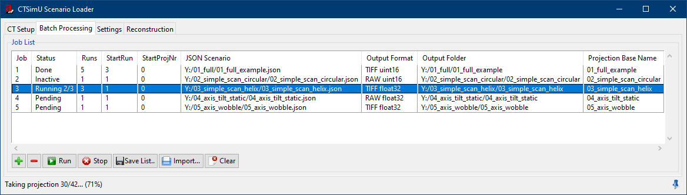
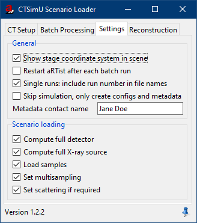

# CTSimU aRTist Module

This is a module for the radiographic simulator [aRTist](http://artist.bam.de/) which reads and sets up the scenario from a [CTSimU Scenario Description](https://bamresearch.github.io/ctsimu-scenarios/) file. With the module, it is also possible to simulate the complete CT scan as described in the JSON scenario.

## Requirements

+ [aRTist](http://artist.bam.de/), version 2.12

## Installation

1. Download the aRTist package file (`CTSimU-<version>.artp`) for the latest [release](https://github.com/BAMresearch/ctsimu-artist-module/releases).
2. Drag and drop the `.artp` file into your aRTist window to install the module.

## Example scenarios

You can find [example scenario files](https://github.com/BAMresearch/ctsimu-scenarios/tree/main/examples) that you can load with this module on the Github repository for the CTSimU Scenario Descriptions.

## Known limitations

+ **Pixel binning** is not supported. Such an operation can be applied as a post-processing step using the [CTSimU Toolbox](https://github.com/BAMresearch/ctsimu-toolbox).
+ **Continuous-motion** scans are not supported, only stop&go mode. Drifts between the frames of an averaged projection are not handled. Therefore, motion blurring within one projection image cannot be simulated.
+ **Parallel beam** geometries are not supported. As a workaround, a very high source-detector distance could be chosen in the JSON file.
+ Detector: **rear window and filters** are not supported, only the *front* versions. If they are needed for a scatter simulation, they should be included in the scene as samples (fixed to the world coordinate system).
+ If **flat-field correction** is turned on in the JSON file, aRTist's internal flat-field correction will be used. This means that the flat-field corrected image will be re-scaled to the mean intensity of the flat field image instead of the free-beam maximum, and an ideal (noise-free) image will be taken for aRTist's internal flat-field image. It is recommended to turn off flat-field `correction` in the JSON file and instead use the [CTSimU Toolbox](https://github.com/BAMresearch/ctsimu-toolbox) to run the correction after the simulation (using the simulated flat field and dark field images). A flat-field correction Python script will be generated by the module along with the simulation output files.

## Graphical User Interface (GUI)

### CT Setup

The module's GUI only shows a few simulation parameters that can be changed before a simulation run. The full parameters of the CT scan are loaded from a [CTSimU scenario description](https://bamresearch.github.io/ctsimu-scenarios/) JSON file and stored in the background, unseen by the user. To use the module, it is therefore always necessary to start by loading a CTSimU scenario file.

#### Loading a CTSimU scenario

1. Select a JSON file that contains a CTSimU scenario.
2. Press the button **Load.**

#### CT Projection settings

The terms *projection* and *frame* are used interchangeably by the module. Strictly speaking, a number of *frames* is averaged into a *projection image*, but since the module does not currently support motion blurring, they both mean the same here.

+ **Start angle:** the rotation angle of the sample stage at the start of the CT scan. *(This value is automatically imported from the scenario file.)*
+ **Stop angle:** the rotation angle of the sample stage at the end of the CT scan. *(This value is automatically imported from the scenario file.)*
+ **Projections:** number of projection images to take for the CT scan simulation. In standard mode, the projection images are taken at equidistant angular positions between start angle and stop angle. However, in general, the JSON file can use drift parameters to alter the angular step size between projection images. Such drifts are not displayed in the GUI but would still be taken into account during the simulation. *(This value is automatically imported from the scenario file.)*
+ **Display frame nr.:** The frame number, i.e. projection number, to be set up in the aRTist scene. Press the button *Show frame* if you wish to see this specific frame configuration in the aRTist scene.
+ **Final projection is taken at stop angle:** if activated, the last projection image will be taken at the stop angle. If not activated, the last projection image will be taken at the last angular step before the stage reaches the stop angle. This means that this option slightly changes the angular step size, depending on the choice. *(This parameter is automatically imported from the scenario file.)*
+ **Show frame:** The aRTist scene will be set up to show the projection number chosen under *Display frame nr.* The other parameters described above are taken into account as well.
+ The buttons **<** (previous frame) and **>** (next frame) let you browse through the CT scan frame by frame.

#### Simulation

For a full CT scan simulation, the following options are provided.

+ **Output folder:** The folder where the simulation output should be stored: projection images, metadata and configuration files. By default, the module will set a folder that carries the same name as the JSON file.
+ **Projection base name:** the base file name that the output files should carry, with a sequential number that will be added to the projection images. In the shown example screenshot, the 21 generated projection images would be called:

  `01_full_example_0000.tif`, ..., `01_full_example_0020.tif`
+ **Start at projection nr.:** The projection number where the simulation should be picked up. The first projection image always has the number `0`, but if you want to start the simulation at a later projection number, you can enter that here. This can be used if a simulation was interrupted and should be continued at a certain projection number.
+ **Scatter image interval:** if scatter simulation is activated in the JSON scenario, aRTist will use McRay to calculate scatter images for each projection image. If the scatter simulation should not run for every projection image, a scatter image interval can be specified here to save computation time. A calculated scatter image will remain valid for this number of projection images. In the example screenshot, the scatter image will be re-calculated for every fifth projection image, and then be used for the following five simulated images. For a value of `0` or `1`, the scatter image is calculated for each projection. *(This value is automatically imported from the scenario file if the corresponding aRTist-specific parameter has been set. See below for aRTist-specific parameters supported by the module.)*
+ **File format:** for the projection image output. Can be TIFF or RAW.
+ **Data type:** for the projection image output. Can be 16-bit unsigned integer data (`uint16`) or 32-bit floating point data (`float32`).

Controlling the CT simulation:

+ **Run scenario:** simulates the scenario as described in the JSON file, taking into account the simulation settings from the GUI. Projection images, metadata and configuration files will be stored in the given output folder. (Note that a scenario must always be loaded before it can be run.)
+ **Stop:** cancel a running simulation.

### Batch Manager

The module comes with a batch manager where JSON scenario files can be queued and simulated sequentially in a batch.

#### Controlling the batch manager

The batch manager can be controlled from a row of buttons at the bottom of the module window:

+ **+** choose a JSON scenario file and add it to the job list.
+ **–** delete the selected job from the job list.
+ **Run:** run all pending jobs from the job list.
+ **Stop:** stop the current simulation and halt the execution of the batch.
+ **Save List...:** save the job list as a CSV file.
+ **Import...:** import a job list from a CSV file.
+ **Clear:** remove all jobs from the job list.

#### Editing batch jobs

Most fields in the job list can be edited. The fields have the following meanings.

+ **Status:** current status of the job. The status can be changed manually by clicking on the current status entry.
	- **Pending:** the job will be run during the batch simulation.
	- **Running:** the job is currently being simulated. The number of the current run will be shown.
	- **Inactive:** the job will be skipped during the batch simulation.
	- **Done:** the simulation of the job is done.
	- **ERROR:** an error occurred during the simulation of the batch job. Load the scenario file manually and try to simulate it to find the error. If the scenario loads correctly, the error might be that you don't have write permission or enough memory to store the projection images.
+ **Runs:** the number of simulation repetitions, i.e. how many times the job is simulated. Mostly useful for noisy scans with random elements. A separate folder will automatically be created for each simulation run if more than one run is being simulated by the batch manager.
+ **StartRun:** the number of the run where the simulation should start. If a simulation has been interrupted, it can be picked up at another run number, given here as the *StartRun*.
+ **StartProjNr:** the projection number where the simulation should start for the *StartRun*. If a simulation has been interrupted, it can be picked up at this projection number. The *StartProjNr* only applies to the *StartRun*; subsequent higher runs will all start at projection `0` again.
+ **JSON Scenario:** file that contains the [CTSimU scenario description](https://bamresearch.github.io/ctsimu-scenarios/).
+ **Output Format:** file format and data type for the simulated projection images. By default, the settings from the *CT Setup* tab are used.
+ **Output Folder:** where to store the simulated projection images and additional metadata and configuration files.
+ **Projection Base Name:** the base file name that the output files should carry, with a sequential number that will be added to the projection images. (See *CT Setup* above.)

### Settings

Parameters that can be set up in the *Settings* tab:

+ **Show stage coordinate system in scene:** when a scenario is loaded, the sample stage will be added as an object to aRTist's part list and will be displayed in the scene as a coordinate system. The stage's material will be set to `none`, it will therefore not have any influence on the projection image. The stage model displays the current location and orientation of the sample stage in the selected frame. The size of the stage model will be scaled to match 2/3 of the scenario's detector height.
+ **Restart aRTist after each batch run:** to save memory, the batch manager can restart aRTist after each completion of a batch run. The batch simulation will continue after the restart.
+ **Create CERA config file:** creates a CERA reconstruction configuration file as part of a scan simulation. The configuration file will come with a list of projection matrices for each frame that CERA can use for the reconstruction. However, the reconstruction configuration will also contain parameters for a circular trajectory reconstruction. If these parameters shall be used by CERA, the list of projection matrices should be de-referenced in the config file, i.e. the parameter `ProjectionMatrixFilename` should be commented or removed from the config file.
	- **CERA volume data type:** data type of the reconstruction's output volume file.
+ **Create OpenCT config file:** creates an OpenCT reconstruction configuration file, for example supported by VGSTUDIO.
	- **OpenCT volume data type:** data type of the reconstruction's output volume file.

## Tcl API

The module is written in Tcl, in a way that it can also be used without aRTist (in a limited way). There are also functions to control the module within aRTist by passing a prepared Tcl script as an argument to an aRTist instance. The [documentation](docs/README.md) of the code, API and classes can be found in the `docs` folder. You can find demo Tcl scripts in the [examples](examples/) folder of this repository.

## Feature support for JSON scenarios

The following table lists the module's current support status for the JSON parameters defined by the [CTSimU file format](https://bamresearch.github.io/ctsimu-scenarios/).

| Parameter                                             | Support     | Drift Support                                      |
| :---------------------------------------------------- | :---------- | :------------------------------------------------- |
| `environment material_id`                             | yes         | only in material definition (density, composition) |
| `environment temperature`                             | no          | no                                                 |
| `geometry detector center x/y/z`                      | yes         | yes                                                |
| `geometry detector vector_u x/y/z`                    | yes         | yes                                                |
| `geometry detector vector_w x/y/z`                    | yes         | yes                                                |
| `geometry detector deviations`                        | yes         | yes                                                |
| `geometry source type`                                | `cone`      | no                                                 |
| `geometry source beam_divergence`                     | no          | no                                                 |
| `geometry source center x/y/z`                        | yes         | yes                                                |
| `geometry source vector_u x/y/z`                      | yes         | yes                                                |
| `geometry source vector_w x/y/z`                      | yes         | yes                                                |
| `geometry source deviations`                          | yes         | yes                                                |
| `geometry stage center x/y/z`                         | yes         | yes                                                |
| `geometry stage vector_u x/y/z`                       | yes         | yes                                                |
| `geometry stage vector_w x/y/z`                       | yes         | yes                                                |
| `geometry stage deviations`                           | yes         | yes                                                |
| `detector model`                                      | yes         | no                                                 |
| `detector manufacturer`                               | yes         | no                                                 |
| `detector type`                                       | yes         | no                                                 |
| `detector columns`                                    | yes         | yes                                                |
| `detector rows`                                       | yes         | yes                                                |
| `detector pixel_pitch u/v`                            | yes         | yes                                                |
| `detector bit_depth`                                  | yes         | no                                                 |
| `detector integration_time`                           | yes         | yes                                                |
| `detector dead_time`                                  | no          | no                                                 |
| `detector image_lag`                                  | no          | no                                                 |
| `detector gray_value imax`                            | yes         | yes                                                |
| `detector gray_value imin`                            | yes         | yes                                                |
| `detector gray_value factor`                          | yes         | yes                                                |
| `detector gray_value offset`                          | yes         | yes                                                |
| `detector gray_value intensity_characteristics_file`  | yes         | yes                                                |
| `detector gray_value efficiency_characteristics_file` | yes         | yes                                                |
| `detector noise snr_at_imax`                          | yes         | yes                                                |
| `detector noise noise_characteristics_file`           | yes         | yes                                                |
| `detector gain`                                       | no          | no                                                 |
| `detector unsharpness basic_spatial_resolution`       | yes         | yes                                                |
| `detector unsharpness mtf`                            | yes         | yes                                                |
| `detector bad_pixel_map`                              | no          | no                                                 |
| `detector scintillator material_id`                   | yes         | only in material definition (density, composition) |
| `detector scintillator thickness`                     | yes         | yes                                                |
| `detector window front`                               | yes         | yes                                                |
| `detector window rear`                                | no          | no                                                 |
| `detector filters front`                              | yes         | yes                                                |
| `detector filters rear`                               | no          | no                                                 |
| `source model`                                        | yes         | no                                                 |
| `source manufacturer`                                 | yes         | no                                                 |
| `source voltage`                                      | yes         | yes                                                |
| `source current`                                      | yes         | yes                                                |
| `source target material_id`                           | yes         | only in material definition (density, composition) |
| `source target type`                                  | yes         | no                                                 |
| `source target thickness`                             | yes         | yes                                                |
| `source target angle incidence`                       | yes         | yes                                                |
| `source target angle emission`                        | yes         | yes                                                |
| `source spot size u/v/w`                              | yes         | yes                                                |
| `source spot sigma u/v/w`                             | yes         | yes                                                |
| `source spot intensity_map file`                      | yes         | yes                                                |
| `source spot intensity_map type`                      | yes         | no                                                 |
| `source spot intensity_map dim_x/y/z`                 | yes         | no                                                 |
| `source spot intensity_map endian`                    | yes         | no                                                 |
| `source spot intensity_map headersize`                | yes         | no                                                 |
| `source spectrum monochromatic`                       | yes         | no                                                 |
| `source spectrum file`                                | yes         | yes                                                |
| `source window material_id`                           | yes         | only in material definition (density, composition) |
| `source window thickness`                             | yes         | yes                                                |
| `source filters material_id`                          | yes         | only in material definition (density, composition) |
| `source filters thickness`                            | yes         | yes                                                |
| `samples name`                                        | yes         | no                                                 |
| `samples file`                                        | yes         | yes                                                |
| `samples unit`                                        | yes         | no                                                 |
| `samples scaling_factor r/s/t`                        | yes         | yes                                                |
| `samples material_id`                                 | yes         | only in material definition (density, composition) |
| `samples position center u/v/w/x/y/z`                 | yes         | yes                                                |
| `samples position vector_r u/v/w/x/y/z`               | yes         | yes                                                |
| `samples position vector_t u/v/w/x/y/z`               | yes         | yes                                                |
| `samples position deviations`                         | yes         | yes                                                |
| `acquisition start_angle`                             | yes         | no                                                 |
| `acquisition stop_angle`                              | yes         | no                                                 |
| `acquisition direction`                               | yes         | no                                                 |
| `acquisition scan_mode`                               | `"stop+go"` | no                                                 |
| `acquisition scan_speed`                              | no          | no                                                 |
| `acquisition number_of_projections`                   | yes         | no                                                 |
| `acquisition include_final_angle`                     | yes         | no                                                 |
| `acquisition frame_average`                           | yes         | no                                                 |
| `acquisition dark_field number`                       | yes         | no                                                 |
| `acquisition dark_field frame_average`                | -           | no                                                 |
| `acquisition dark_field ideal`                        | only ideal  | no                                                 |
| `acquisition dark_field correction`                   | no          | no                                                 |
| `acquisition flat_field number`                       | yes         | no                                                 |
| `acquisition flat_field frame_average`                | yes         | no                                                 |
| `acquisition flat_field ideal`                        | yes         | no                                                 |
| `acquisition flat_field correction`                   | yes         | no                                                 |
| `acquisition pixel_binning u/v`                       | no          | no                                                 |
| `acquisition scattering`                              | yes (McRay) | no                                                 |
| `materials id`                                        | yes         | no                                                 |
| `materials name`                                      | yes         | no                                                 |
| `materials density`                                   | yes         | yes                                                |
| `materials composition formula`                       | yes         | yes                                                |
| `materials composition mass_fraction`                 | yes         | yes                                                |

### Deviations

[Geometry deviations](https://bamresearch.github.io/ctsimu-scenarios/geometry.html#deviations) as specified in the file format are fully supported.

| Parameter                  | Support     | Drift Support  |
| :------------------------- | :---------- | :------------- |
| `type`                     | yes         | no             |
| `axis` as name string      | yes         | no             |
| `axis x/y/z`               | yes         | yes            |
| `axis u/v/w`               | yes         | yes            |
| `axis r/s/t`               | yes         | yes            |
| `pivot x/y/z`              | yes         | yes            |
| `pivot u/v/w`              | yes         | yes            |
| `pivot r/s/t`              | yes         | yes            |
| `amount`                   | yes         | yes            |
| `known_to_reconstruction`  | yes         | no             |

### aRTist-specific parameters

The module supports additional parameters that are specific for aRTist. These can be set up in the [`"simulation"` section](https://bamresearch.github.io/ctsimu-scenarios/proprietary.html) of the JSON file:

	{
	  "simulation": {
	    "aRTist": {
	      "multisampling_detector":    {"value": "3x3"},
	      "multisampling_spot":        {"value": "30"},
	      "spectral_resolution":       {"value": 1, "unit": "keV"},
	      "scattering_mcray_photons":  {"value": 5e7},
	      "scattering_image_interval": {"value": 5},
	      "long_range_unsharpness": {
	        "extension": {"value":  2, "unit": "mm"},
	        "ratio":     {"value": 10, "unit": "%"}
	      },
	      "primary_energies": false,
	      "primary_intensities": false
	    }
	  }
	}

| Parameter                                             | Support     | Drift Support                                      |
| :---------------------------------------------------- | :---------- | :------------------------------------------------- |
| `simulation aRTist multisampling_detector`            | yes         | yes                                                |
| `simulation aRTist multisampling_spot`                | yes         | yes                                                |
| `simulation aRTist spectral_resolution`               | yes         | no                                                 |
| `simulation aRTist scattering_mcray_photons`          | yes         | no                                                 |
| `simulation aRTist scattering_image_interval`         | yes         | no                                                 |
| `simulation aRTist long_range_unsharpness extension`  | yes         | yes                                                |
| `simulation aRTist long_range_unsharpness ratio`      | yes         | yes                                                |
| `simulation aRTist primary_energies`                  | yes         | no                                                 |
| `simulation aRTist primary_intensities`               | yes         | no                                                 |

## The devil in the details

+ If **X-ray spectra** are loaded from an external file instead of being generated in aRTist, the JSON file should still specify the tube's correct acceleration `voltage`. If the maximum energy in the spectrum drifts significantly (by more than 20 keV), the source's `voltage` parameter should also drift, reflecting the maximum energy in the spectrum. Alternatively, instead of a drift, the `voltage` parameter could simply represent the maximum acceleration voltage during the scan. The reason is that the maximum photon energy is needed for the computation of the detector's sensitivity characteristics, in order to save computation time and only run the computations for the necessary energy range. This maximum photon energy is determined from the source's `voltage` parameter and not from an externally loaded spectrum.
+ **X-ray spectra** are *always* expected to be already filtered by any defined source `window`. If the window thickness or its material drifts, the externally loaded spectrum will **not** be re-filtered to account for these changes. Instead, the externally loaded spectrum should drift as well (to account for the changing window). If aRTist calculates the spectrum itself, any window drifts are taken into account.
+ When using **frame averaging,** make sure to understand how aRTist's frame averaging works. aRTist's approach is to shift the SNR curve to the intensity of the integration time of the accumulated number of averaged frames, and then take one projection image. It does not calculate several frames and mathematically average them. This can give an undesired result if you have a non-standard SNR curve, especially when aRTist has to interpolate the curve to higher intensities if they are not explicitly given.

## Deploying a new version

The `deploy.sh` script can be used to create an `.artp` file for aRTist for a certain version number. The new version number is passed as an argument:

	./deploy.sh "<version>"

For example:

	./deploy.sh "1.2.0"

Note: the aRTist package file (`.artp`) should not be part of the git repository. Instead, it can be uploaded to Github as a file attachment to a new release.

## Version History

### 1.2.1
+ Bug fix: projection counter error for more than one ideal flat field.

### 1.2.0
+ General support for file format version 1.0, 1.1 and 1.2
+ Parameter drifts are supported
+ Scatter images can be kept for a user-defined number of frames, instead of calculating a new scatter image for each frame.
+ Option to restart aRTist after each batch run. (To free memory.)
+ New supported JSON features:
  - new geometrical deviations (translations and rotations along arbitrary axes or pivot points)
  - source: spot images
  - detector: MTF
  - detector: quantum efficiency
  - detector: external noise characteristics files
  - `known_to_reconstruction` parameter for geometrical deviations and drifts is obeyed when calculating projection matrices.

### 0.8.18
+ Fix in CERA reconstruction config files: the `Datatype` parameter is now inactive (made into a comment), only `OutputDatatype` left as valid parameter for the volume data type.

### 0.8.17
+ Small updates and fixes in reconstruction config file outputs.

### 0.8.16
+ Added aRTist-specific JSON option to create primary intensity images (as an alternative to primary energy images).

### 0.8.15
+ Minor bug fix: Parts not loaded centered at (0,0,0) since version 0.7.10 due to a spelling mistake. This bug had no impact on part placement: centering parts after loading is not necessary and has therefore been fully removed in this version.

### 0.8.14
+ Removed iSRb correction scaling factor of 0.6830822016 (for aRTist 2.12+).
+ Added aRTist-specific JSON option to create primary energy images.

### 0.8.13
+ Added options for recon volume data type (`uint16`, `float32`).
+ Cleaned up VGI output.
+ Physical pixel size is used in factor/offset detector grey value method, instead of iSRb-scaled pixel area from the DetectorCalc module.

### 0.8.12
+ Added new function: insertBatchJob, to allow better control of batch job parameters.

### 0.8.11

+ Added spectral resolution for spectrum generator as aRTist-specific parameter.

### 0.8.10

+ Finite spot size scenarios: spot sampling will be set to 20 and detector sampling to 2x2 (instead of 30 and 'source dependent' as before).

### 0.8.9

+ Bug fix: relative paths in recon configs now correct for batches with multiple runs.
+ Bug fix: CERA format specifier for float32 raw projection images.

### 0.8.8

+ Bug fix: tubes with no window no longer wrongfully show 'Al 4 mm' in their name.

### 0.8.7

+ Fixed aRTist unsharpness (moved from Gaussian sigma correction factor 1/sqrt(2) to 0.683).

### 0.8.6

+ Added support for running the flat field correction during a scan.

### 0.8.5

+ Added support for long range unsharpness.

### 0.8.4

+ Scans can start at user-defined projection numbers so simulations can be continued after crashes.
+ Index numbers in projection filenames only take 4 digits (or more, only if necessary).
+ Scattering is automatically deactivated for dark images.

### 0.8.2 - 0.8.3

+ No release; used for development tests.

### 0.8.1

+ Added `ffRescaleFactor` to generated flat field correction scripts.

### 0.8.0

+ Bug fix: memory leak when running a simulation
+ Batch Manager: 'StartRun' specifies the run id where the batch should start. Enables picking up simulations after a crash.
+ Support for simulation software-specific parameters: 'multisampling_detector', 'multisampling_spot', 'scattering_mcray_photons'

### 0.7.15

+ Bug fix: division by zero when SOD is 0.

### 0.7.14

+ Multiple JSON scenarios can be added at once to the batch queue.

### 0.7.13

+ Added fileutil as a package requirement. Some systems showed problems without it.

### 0.7.12

+ Added the object bounding box to clFDK/VG reconstruction configuration files.

### 0.7.11

+ Added support for CERA's RDabcu0v0 coordinate system to provide a reconstruction configuration alternative to the projection matrix approach.

### 0.7.10

+ For CT scans, reconstruction configurations for SIEMENS CERA, BAM clFDK, and also VG Studio (untested) are created using projection matrices.
+ Bug fixes concerning unusual geometries.
+ Last used settings for output file types and reconstruction configurations are saved when aRTist closes.

### 0.7.9

+ Removed option to (not) import all samples from JSON, to avoid confusion. Loading a scenario will now always load _complete_ scenario.

### 0.7.8

+ 'rl_json' is now used for JSON handling, instead of tcllib's json module.

### 0.7.7

+ Added a batch manager to handle job queues.
+ Environment material is considered as an additional spectrum filter when calculating the detector characteristics. Therefore, the specified grey values at maximum intensity are reached for any environment material, not only in vacuum.

### 0.7.6

+ Fixed memory leak when running a CT scan.
+ JSON files are now closed after being read, and no longer blocked from deletion/renaming.
+ Applied Florian Wohlgemuth's fix of CanClose() for using the module in batch simulations.

### 0.7.5

+ Fixed detector saturation when using a filter in front of an ideal detector.

### 0.7.4

+ CTSimU metadata files are created along CT scan projection image stacks.
+ Fixed a bug concerning orientation vectors pointing in opposite directions (e.g. sample flipped in stage coordinate system).

### 0.7.2

+ Bug fixes concerning coordinate system positioning.

### 0.7.1

+ Implemented sample scaling (according to definition in JSON's sample section).

### 0.7.0

+ Support for CTSimU JSON scenario definition version 0.7

### 0.6.0

+ Support for CTSimU JSON scenario definition version 0.6

### 0.5.0

+ Support for CTSimU JSON scenario definition version 0.5

### 0.4.0

+ Support for CTSimU JSON scenario definition version 0.4