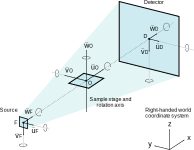

# ::ctsimu::scenario
The main class for a complete CT scan scenario. This class keeps everything together: simulation settings and virtual scenario parameters (usually from a [CTSimU JSON file](https://bamresearch.github.io/ctsimu-scenarios)).

## Methods of the `::ctsimu::scenario` class

* `get { setting }` — Get the value of a settings parameter. See table below.
* `set { setting value }` — Set the `setting` parameter to the given `value`. See table below.
* `reset` — Reset scenario to standard settings.
* `load_json_scene { json_filename }` — Loads a CTSimU scenario from the given JSON file.

### Current simulation status:

* `is_running` — Is the simulation currently running? (`0` or `1`)
* `is_full_simulation` — Was the full scenario loaded (`1`) or a quick, limited version (`0`)?
* `batch_is_running` — Is the batch queue currently running? (`0` or `1`)
* `json_loaded_successfully` — Scenario loaded successfully? (`0` or `1`)

### Status setters (intended only for internal use):

* `_set_run_status { status }`
* `_set_json_load_status { status }`

### Preparation functions, mostly for internal use:

* `set_basename_from_json { json_filename }` — Extracts the base name of a JSON file and sets the `output_basename` setting accordingly.
* `create_projection_counter_format { nProjections }` — Sets the number format string to get the correct number of digits in the consecutive projection file names.
* `create_run_filenames { { run 1 } { nruns 1 } }` — Generate the strings for output basename, projection folder and reconstruction folder. Decides whether the run number must be added.

### Getters

* `detector` — Return the scenario's [detector](detector.md) object.
* `source` — Return the scenario's [source](source.md) object.
* `stage` — Return the scenario's [stage](stage.md) object.

### Scan simulation

* `set_next_frame` — Set up the next frame in aRTist.
* `set_previous_frame` — Set up the previous frame in aRTist.
* `set_frame { frame }` — Set up the given `frame` number in the aRTist scene.
* `set_frame_for_recon { frame }` — Internally set up coordinate systems for scene as "seen" by the reconstruction software. Used to compute projection matrices.
* `update` — Calculate some geometry parameters (SDD, SOD, ODD) for the current frame.
* `get_current_stage_rotation_angle` — Stage rotation angle for the current frame.
* `stop_scan { { noMessage 0 } }` — Stop the scan simulation. `noMessage` can be set to `1` if the "Stopped" status message should not appear in the module's GUI.
* `start_scan { { run 1 } { nruns 1 } }` — Start the scan simulation for the given `run` number, out of a total of `nruns`.
* `render_projection_image { projNr }` — Run a full simulation in aRTist to get the projection image for the given projection number (`projNr`). `set_frame` must have been called beforehand.
* `save_projection_image { projNr fileNameSuffix}` — Save the currently simulated projection image.
* `generate_flats_and_darks` — Generate flat field and dark field images (if required by the scenario).
* `progress_info { message }` — Display progress info, possibly prepend a warning message if a partial scenario is being simulated.

### Config and metadata files

The module can generate a number of configuration files for a subsequent CT reconstruction and a CTSimU metadata file for the simulated projection images.

* `is_run_number_in_filenames` — Returns `1` if run number will be included in file names, otherwise `0`.
* `prepare_postprocessing_configs` — Generates the flat field correction Python script and config files for various reconstruction softwares, depending on the current settings.
* `create_flat_field_correction_script` — Create a flat field correction script for Python, using the CTSimU Toolbox.
* `create_metadata_file  { { mode "projections"} }` — Create a metadata JSON file for the simulation. Mode can be either `"projections"` or `"reconstruction"`, depending on where the file shall be saved and for which purpose it will be adapted.
* `create_recon_configs` — Create config files for the individual reconstruction programs (if required by the scenario).
* `save_clFDK_script` — Creates a .bat file that allows to reconstruct the scan using clFDK.
* `save_openCT_config_file { projectionFilenames projectionMatrices }` — Creates a reconstruction configuration file in the OpenCT file format.
* `save_CERA_config_file { projectionMatrices }` — Create a reconstruction config file for SIEMENS CERA.
* `save_VGI { name filename volumeFilename zMirror voxelsizeU voxelsizeV }` — Prepares a VGI file for the reconstruction volume such that it can be loaded with VGSTUDIO.

### Reconstruction geometry helpers

* `projection_matrix { { volumeCS 0 } { imageCS 0 } { mode 0 } }` — Calculate a projection matrix for the current geometry. Parameters:
	- `volumeCS`: A [`::ctsimu::coordinate_system`](coordinate_system.md) that gives the position of the reconstruction volume in terms of the stage coordinate system. If `0` is given, the volume coordinate system is assumed to be the stage coordinate system. See below for details.
	- `imageCS`: A [`::ctsimu::coordinate_system`](coordinate_system.md) that gives the position of the image in terms of the detector coordinate system. If `0` is given, the image coordinate system is assumed to be the detector coordinate system. See below for details.
	- `mode`: Pre-defined modes. Either `"OpenCT"` or `"CERA"` are supported. They override the `volumeCS` and `imageCS`, which can be set to `0` when using one of the pre-defined modes.

	The image coordinate system (`imageCS`) should match the location, scale and orientation used by the reconstruction software and is expressed in terms of the detector coordinate system.

	The detector coordinate system has its origin at the detector `center`, the `u` unit vector points in the row vector direction, and the `v` unit vector points in column vector direction (they are always assumed to be unit vectors).

	The `center` (origin) of the `imageCS` should be where the reconstruction software places the origin of its own projection image coordinate system. For example, CERA places it at the center of the lower-left pixel of the projection image.

	Similarly, a volume coordinate system (`volumeCS`) can be provided that describes the location, scale and orientation of the reconstruction volume with respect to the stage coordinate system.

	If the reconstruction software expects a different unit for the image or volume coordinate system (e.g. mm or voxels) than the world coordinates (e.g. mm), you can scale the basis vectors accordingly. For example, if you need a pixel and voxel coordinate system instead of a millimeter coordinate system, scale the basis vectors by the respective pixel and voxel size:

		[$imageCS u] scale $pixelSize_u
		[$imageCS v] scale $pixelSize_v
		[$imageCS w] scale 1.0; # Do not scale the detector normal!
		[$volumeCS u] scale $voxelSize_u
		[$volumeCS v] scale $voxelSize_v
		[$volumeCS w] scale $voxelSize_w

* `set_up_CERA_RDabcuv` — Calculates all parameters for an ideal circular trajectory reconstruction in CERA without projection matrices. These are added to the reconstruction config file for CERA, just in case the user does not wish to use projection matrices.

## Settings parameters

The class keeps a `_settings` dictionary to store simulation-related settings. The methods `get` and `set` are used to retrieve and manipulate these settings.

The following table gives an overview of the currently used keys and their meanings.

| Settings Key                     | Description                                                         |
| :------------------------------- | :------------------------------------------------------------------ |
| `json_file`                      | The absolute path of the currently loaded CTSimU scenario description. |
| `json_file_name`                 | The name (without path) of the loaded CTSimU scenario description.  |
| `json_file_directory`            | Directory of the currently loaded CTSimU scenario file.             |
| `output_fileformat`              | File format of the projection images: `raw` or `tiff`.              |
| `output_datatype`                | Data type of the projection images: `uint16` or `float32`.          |
| `output_folder`                  | Where the projection files and simulation results will be stored.   |
| `output_basename`                | Name of the simulation. Precedes output filenames, e.g. for images. |
| `start_angle`                    | Angle where CT rotation starts.                                     |
| `stop_angle`                     | Angle where CT rotation stops.                                      |
| `projection_counter_format`      | Counter format for sequential projection image number. Generated automatically based on the number of projection images. |
| `include_final_angle`            | Take the last projection at the stop angle? (`0` or `1`)            |
| `start_projection_number`        | Projection number where to start the simulation (useful if a simulation crashed). |
| `scan_direction`                 | Clockwise (`"CW"`) or counter-clockwise (`"CCW"`)                   |
| `scattering_on`                  | Run scatter image simulations using McRay? (`0` or `1`)             |
| `scattering_image_interval`      | Interval after how many projections a new scatter image is calculated. |
| `scattering_mcray_photons`       | Number of photons for McRay to simulate for the scatter image.      |
| `n_darks`                        | Number of dark field images to create.                              |
| `n_darks_avg`                    | Number of frame averages for a dark field image.                    |
| `n_flats`                        | Number of flat field images to create.                              |
| `n_flat_avg`                     | Number of frame averages for a flat field image.                    |
| `dark_field_ideal`               | Generate an ideal (noise-free) dark field image? (`0` or `1`)       |
| `flat_field_ideal`               | Generate an ideal (noise-free) flat field image? (`0` or `1`)       |
| `ff_correction_on`               | Run a flat field correction in aRTist? (`0` or `1`)                 |
| `current_frame`                  | Current frame number.                                               |
| `frame_average`                  | Number of frames to average into one projection.                    |
| `n_projections`                  | Total number of projection images from the CT scan.                 |
| `n_frames`                       | Total number of frames in scan.                                     |
| `environment_material`           | Material id for the environment.                                    |
| `contact_name`                   | Contact name for the metadata file.                                 |
| `show_stage`                     | Show stage in aRTist scene?                                         |
| `skip_simulation`                | Skip simulation and only create config/metadata files?              |
| `run_number_always_in_filenames` | Run number in file and folder names, even for single runs.          |
| `restart_aRTist_after_each_run`  | Batch manager: restart aRTist after each run?                       |
| `onload_compute_detector`        | Compute full detector?                                              |
| `onload_compute_source`          | Compute full X-ray source?                                          |
| `onload_load_samples`            | Load samples from scenario?                                         |
| `onload_scattering_active`       | Set multisampling for scenario?                                     |
| `onload_multisampling`           | Set scattering if required by scenario?                             |
| `recon_output_datatype`          | Output datatype for the reconstruction volume.                      |
| `recon_config_uncorrected`       | Prepare recon configs for uncorrected projection images?            |
| `create_cera_config_file`        | Create a CERA reconstruction config file?                           |
| `create_openct_config_file`      | Create an OpenCT reconstruction config file?                        |
| `openct_abs_paths`               | Use absolute file paths in OpenCT config file?                      |
| `openct_circular_enforced`       | Enforce the circular trajectory file format variant?                |
| `create_clfdk_run_script`        | Create a batch file for a clFDK reconstruction?                     |